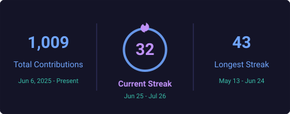

<!-- ============================================================ -->

<!--                         HERO SECTION                         -->

<!-- ============================================================ -->

  

<h2>AI/ML Engineer • Researcher • Builder</h2>

Building intelligent systems across
<b>Artificial Intelligence</b>,
<b>Computer Vision</b>,
<b>Medical AI</b>,
<b>Multimodal AI</b> and
<b>Autonomous Agents</b>.

 

<!-- ============================================================ -->

<!--                    CONNECT ICONS                             -->

<!-- ============================================================ -->

<table>
<tr>

<td align="center" width="100">

 
<b>Portfolio</b>
</td>

<td width="28"></td>

<td align="center" width="100">

 
<b>LinkedIn</b>
</td>

<td width="28"></td>

<td align="center" width="100">

 
<b>Email</b>
</td>

<td width="28"></td>

<td align="center" width="100">

 
<b>Discord</b>
</td>

</tr>
</table>

 

<!-- ============================================================ -->

<!--                    PROFILE HIGHLIGHTS                        -->

<!-- ============================================================ -->

<table>
<tr>

<td align="center">

</td>

<td width="14"></td>

<td align="center">

</td>

<td width="14"></td>

<td align="center">

</td>

</tr>
</table>

 

<code>AI/ML</code>
&nbsp;•&nbsp;
<code>Computer Vision</code>
&nbsp;•&nbsp;
<code>Medical AI</code>
&nbsp;•&nbsp;
<code>Multimodal AI</code>
&nbsp;•&nbsp;
<code>Autonomous Agents</code>

---

# 💫 About Me

I'm an **AI/ML Engineer & Upcoming Researcher** pursuing B.Tech in CSE (AI) at Amrita Vishwa Vidyapeetham (2023–2027), with an IEEE-published paper in clinical ML at ICOCT 2025. I design and ship production AI systems spanning **Computer Vision, Medical Imaging, and Multi-LLM Routing** — including Jarvis, a 7-model autonomous assistant with real-time voice, vision, and sub-10ms RAG retrieval. Passionate about pushing the boundaries of Vision Transformers, self-supervised learning (DINO/DINOv2), and scalable Vision-Language Models.

---

# 🧬 Research & Publication

<h2>Liver Disease Diagnosis using RFXG Classifier</h2>

<b>IEEE ICOCT 2025</b> • Clinical Machine Learning • Ensemble Learning

 

<!-- ============================================================ -->

<!--                     RESEARCH OVERVIEW                        -->

<!-- ============================================================ -->

<table>

<tr>
<td align="center" width="180">
<b>📄 Publication</b>
</td>
<td align="left">
<b>IEEE ICOCT 2025</b> — International Conference on Cloud and Technology
</td>
</tr>

<tr>
<td align="center">
<b>🎯 Objective</b>
</td>
<td align="left">
Automated liver disease diagnosis using machine learning on clinical patient data.
</td>
</tr>

<tr>
<td align="center">
<b>🧠 Proposed Model</b>
</td>
<td align="left">
<b>RFXG Classifier</b> — ensemble approach combining Random Forest and XGBoost.
</td>
</tr>

<tr>
<td align="center">
<b>⚙️ Methodology</b>
</td>
<td align="left">
Data preprocessing → Feature engineering → Ensemble learning → Model evaluation → Statistical validation
</td>
</tr>

<tr>
<td align="center">
<b>📊 Evaluation</b>
</td>
<td align="left">
ROC-AUC • F1-Score • Precision • Recall • Precision-Recall Analysis
</td>
</tr>

<tr>
<td align="center">
<b>🔬 Statistical Validation</b>
</td>
<td align="left">
McNemar's Significance Test for comparative model evaluation.
</td>
</tr>

<tr>
<td align="center">
<b>🏥 Application</b>
</td>
<td align="left">
Clinical decision-support research for automated liver disease diagnosis.
</td>
</tr>

<tr>
<td align="center">
<b>🧪 Research Domain</b>
</td>
<td align="left">
Machine Learning • Clinical AI • Ensemble Learning • Healthcare AI
</td>
</tr>

<tr>
<td align="center">
<b>📌 Research Focus</b>
</td>
<td align="left">
Reliable machine learning evaluation and statistically validated clinical prediction.
</td>
</tr>

</table>

 

<!-- ============================================================ -->

<!--                     RESEARCH STACK                           -->

<!-- ============================================================ -->

<h3>🔧 Research Stack</h3>

<table>
<tr>

<td align="center" width="100">

 
<b>Python</b>
</td>

<td width="40"></td>

<td align="center" width="120">

 
<b>Scikit-learn</b>
</td>

</tr>
</table>

 

<!-- ============================================================ -->

<!--                  RESEARCH PIPELINE                           -->

<!-- ============================================================ -->

<h3>🔬 Research Pipeline</h3>

<table>
<tr>

<td align="center">
<b>01</b> 
📥 
Clinical Data
</td>

<td width="20">→</td>

<td align="center">
<b>02</b> 
⚙️ 
Preprocessing
</td>

<td width="20">→</td>

<td align="center">
<b>03</b> 
🧬 
Feature Engineering
</td>

<td width="20">→</td>

<td align="center">
<b>04</b> 
🧠 
RFXG Ensemble
</td>

<td width="20">→</td>

<td align="center">
<b>05</b> 
📊 
Evaluation
</td>

<td width="20">→</td>

<td align="center">
<b>06</b> 
🔬 
Statistical Validation
</td>

</tr>
</table>

 

---

# 🚀 Featured Projects

## 🤖 01 · Jarvis — Autonomous Multi-Modal AI Assistant

> `Production AI` | **7 AI Models** | Sub-10ms RAG | Real-time Voice + Vision

Production-grade multi-LLM + VLM routing agent integrating **NVIDIA NIM Vision**, Faster-Whisper STT, Edge-TTS, and multi-model reasoning. Async 4-thread pipeline with wake-word detection, long-term RAG memory, and Discord integration.

<table>
<tr>

<td align="center">
⚡ 
<b>RAG Speed</b> 
Sub-10ms retrieval
</td>

<td width="35"></td>

<td align="center">
🧠 
<b>Models</b> 
7 AI models integrated
</td>

<td width="35"></td>

<td align="center">
🎙️ 
<b>Voice</b> 
Wake-word + Real-time TTS
</td>

</tr>
</table>

 

  

  

---

## 🎬 02 · YouTube Shorts Automation

> `AI Automation` | LLM Script → TTS → Video → Auto-Upload

AI-powered end-to-end YouTube Shorts pipeline — topic generation, LLM script writing, TTS voiceover synthesis, automated video editing, and YouTube Data API v3 publishing. Zero manual effort.

  

  

---

## 🩺 03 · Knee OA Medical ViT Ensemble Diagnostic Pipeline

> `Research AI` | **90.07% Accuracy** | **0.830 Cohen's Kappa** | Q1 Journal Standards

Zero-leakage 3-class knee OA classifier on 9,770 X-rays (4,656 patients). Fuses ConvNeXt-Base, Swin Transformer & DINO ViT with custom Ordinal Regression Loss and 4-View TTA. DINO ViT ablation confirmed as dominant backbone (−8.21% on removal).

<table>
<tr>

<td align="center">
<b>90.07%</b> 
Accuracy
</td>

<td width="35"></td>

<td align="center">
<b>0.830</b> 
Cohen's Kappa
</td>

<td width="35"></td>

<td align="center">
<b>9,770</b> 
X-rays
</td>

<td width="35"></td>

<td align="center">
<b>4,656</b> 
Patients
</td>

</tr>
</table>

 

  

  

---

## 🧪 04 · Clinical Liver Disease Diagnosis ML Pipeline

> `IEEE Published — ICOCT 2025` | RFXG Classifier | Clinical ML

End-to-end ML pipeline for clinical liver disease prediction — IEEE published. RFXG ensemble evaluated with ROC-AUC, F1, precision-recall, and McNemar's significance testing on real patient data.

  

---

## 🎮 05 · AI Hand Gesture Gaming — Maze Solver

> `🏆 Top 5 Hackathon` | VR Siddhartha Engineering College 2025

Real-time hand gesture tracking fused with graph pathfinding — 100% gesture-controlled maze navigation with no keyboard or mouse. **Top 5 Finalist** out of all competing teams.

  

  

---

# ⚡ Tech Stack

## 🧠 Deep Learning & Computer Vision

  

---

## 💻 Languages & Frameworks

  

---

## ☁️ Cloud & Infrastructure

  

---

## 🛠️ Development Tools

  

---

# 🏆 Certifications & Achievements

<table>

<tr>
<th></th>
<th>Certification / Achievement</th>
<th>Issuer</th>
</tr>

<tr>
<td align="center">☁️</td>
<td><b>AWS Certified Cloud Practitioner</b></td>
<td>Amazon Web Services</td>
</tr>

<tr>
<td align="center">🔷</td>
<td><b>Azure AI Engineer Associate</b></td>
<td>Microsoft</td>
</tr>

<tr>
<td align="center">🧠</td>
<td><b>Oracle Generative AI Professional</b></td>
<td>Oracle</td>
</tr>

<tr>
<td align="center">🗄️</td>
<td><b>Oracle MySQL 8.0 Database Developer</b></td>
<td>Oracle</td>
</tr>

<tr>
<td align="center">🏆</td>
<td><b>Top 5 Finalist — AI Hackathon</b></td>
<td>VR Siddhartha Engineering College</td>
</tr>

<tr>
<td align="center">🌟</td>
<td><b>Infosys Springboard Internship 7.0</b></td>
<td>Infosys</td>
</tr>

</table>

---

# 📊 GitHub Stats

  

---

# 🔗 Connect With Me

<table>
<tr>

<td align="center">

 
Portfolio
</td>

<td width="25"></td>

<td align="center">

 
LinkedIn
</td>

<td width="25"></td>

<td align="center">

 
Email
</td>

<td width="25"></td>

<td align="center">

 
Discord
</td>

</tr>
</table>

 

<b>Let's build something intelligent.</b>

---

### `BUILD` · `RESEARCH` · `SHIP` · `ITERATE`

 

***"Advancing Deep Learning, Vision Transformers & Multimodal Autonomous AI"***

  

